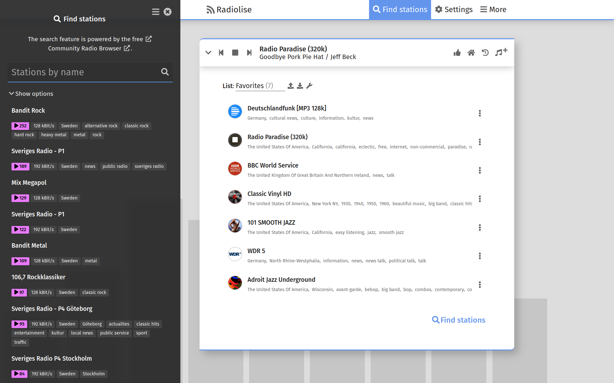

<div align="center">
  
  <h1>Radiolise</h1>
  <a aria-label="License" href="COPYRIGHT.md">
    
  </a>
</div>

<br />

Radiolise is a web app that lets you enjoy your favorite TV and radio stations.
Among other features, it uses the
[Community Radio Browser](http://www.radio-browser.info/) project for the
search.

## Screenshot



## Hosted instances

### Official

| Instance             | URL                                 |
| -------------------- | ----------------------------------- |
| Frontend with TLS    | <https://radiolise.com/>            |
| Frontend without TLS | <http://unencrypted.radiolise.com/> |
| Frontend alternative | <https://radiolise.gitlab.io/>      |
| Backend              | <https://backend.radiolise.com/>    |

Currently, storage data (stations and settings) is not synchronized between
instances unless they belong to the same origin.

## Setup

### Instant start

Install Node.js (18 or later LTS recommended), then create a fresh instance on
your local machine by running:

```sh
npx radiolise
```

### More options

See [setup.md](setup.md).

## Packages

| Package                                                | Release notes                                                                                                                                                | License           |
| ------------------------------------------------------ | ------------------------------------------------------------------------------------------------------------------------------------------------------------ | ----------------- |
| [@radiolise/api](packages/api)                         | [](packages/api/CHANGELOG.md)                                     | MIT Expat         |
| [@radiolise/metadata-client](packages/metadata-client) | [](packages/metadata-client/CHANGELOG.md) | MIT Expat         |
| [radiolise](packages/radiolise)                        | [](packages/radiolise/CHANGELOG.md)                              | AGPL 3.0 or later |

## License

Check out the [COPYRIGHT.md](COPYRIGHT.md) file for details.

<!--
TODO: uncomment
## Support

Feel free to donate or to become a sponsor on GitHub:
<https://github.com/sponsors/mabcelsius>
-->
